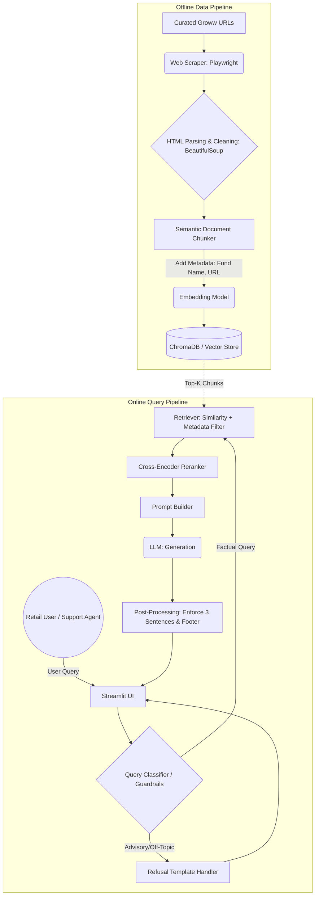
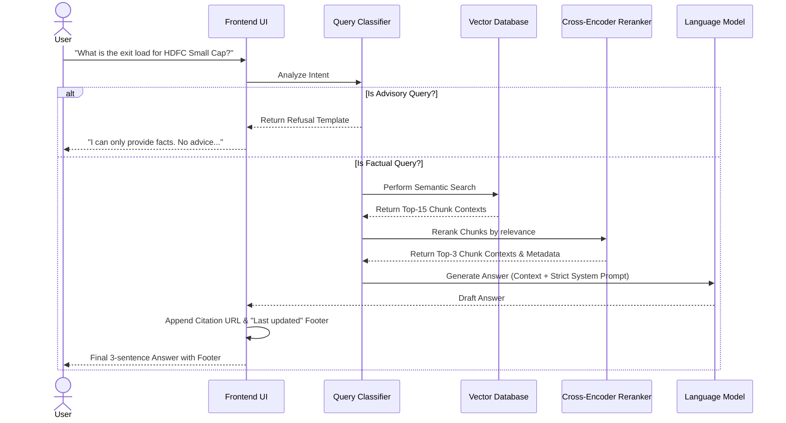

# Detailed System Architecture: Mutual Fund FAQ Assistant

## 1. System Overview
The Mutual Fund FAQ Assistant is a Retrieval-Augmented Generation (RAG) system designed to serve factual, source-backed answers about HDFC mutual funds. The architecture strictly enforces compliance, privacy, and accuracy, utilizing a specific, curated corpus of live HTML pages from **Groww** (a real-time distributor) to prevent hallucination and the generation of investment advice.

---

## 2. High-Level Architecture Diagrams

### 2.1 Component Architecture


### 2.2 Sequence Diagram: Query to Response


---

## 3. Detailed Component Breakdown

### 3.1 Data Ingestion & Processing (Offline Pipeline)
The offline pipeline is responsible for constructing the knowledge base from live web pages.
- **Web Scraper (Playwright)**: Iterates over a curated JSON list of 15 official Groww Mutual Fund pages. A headless browser is required to bypass Cloudflare Bot Management and ensure the React-based frontend fully hydrates the DOM before the HTML is extracted.
- **HTML Parsing (BeautifulSoup)**: Cleans the raw HTML by stripping out `<script>`, `<nav>`, `<style>`, and footer tags. It specifically iterates over `<table>` tags to preserve row/column structure for metrics like Expense Ratio and Exit Loads, converting them to clean text.
- **Semantic Chunker**: Splits the text into manageable chunks (e.g., 1000 characters) while dynamically injecting the Fund Name directly into the chunk text to preserve semantic context across chunk boundaries.
- **Metadata Tagging**: Every chunk receives an injected dictionary of metadata:
  ```json
  {
    "fund_name": "HDFC Small Cap Fund",
    "source_url": "https://groww.in/mutual-funds/hdfc-small-cap-fund-direct-growth",
    "filename": "hdfc-small-cap-fund-direct-growth.html"
  }
  ```
- **Automated Scheduler (Cron Job)**: A daily automated process (e.g., cron or GitHub Actions) that triggers `scraper.py` and `cleaner.py` at a fixed time (e.g., midnight) to ensure the vector database always contains the most up-to-date NAV, Expense Ratios, and Exit Loads from the live Groww platform.

### 3.2 Vector Database and Embeddings
- **Embedding Model**: A dense embedding model (`BAAI/bge-small-en-v1.5`) converts the text chunks into high-dimensional vectors.
- **Vector Store**: **ChromaDB** is used to store the embeddings and metadata locally for ultra-fast cosine similarity lookups.

### 3.3 Query Processing & Guardrails (Online Pipeline)
- **Query Rewriting**: A fast LLM pass rewrites the user query to strip conversational filler and optimize it for semantic keyword search.
- **Query Classification**: Evaluates if the query contains comparative words ("better", "vs") or advisory triggers ("should I", "recommend"). If triggered, a strict refusal template is returned.
- **Cross-Encoder Reranking**: The vector database retrieves a wide net of 15 candidate chunks. A Cross-Encoder model (`cross-encoder/ms-marco-MiniLM-L-6-v2`) rigidly re-scores them to ensure only the 3 most factually relevant chunks are passed to the generator.

### 3.4 Generation (LLM)
- **Prompt Engineering**: The LLM is heavily constrained via the system prompt:
  > "You are a strictly factual mutual fund assistant. You must answer the user's query using ONLY the provided context. If the context does not contain the answer, say 'I do not have this information.' Do not provide investment advice. Limit your response to a maximum of 3 sentences."
- **Model Selection**: Groq LLMs (e.g., `llama-3.1-8b-instant`) are used due to their ultra-low latency and strong instruction-following capabilities.

### 3.5 Post-Processing & Formatting
The system intercepts the LLM's raw output to guarantee formatting compliance:
1. Validates the sentence count (truncates if > 3 sentences).
2. Extracts the `source_url` from the highest-ranking retrieved chunk.
3. Appends the exact footer string: `"Last updated from sources: <date>"` and the precise citation hyperlink.

---

## 4. Security, Privacy, and Scalability

### 4.1 Zero-PII & Statelessness
- **No Conversation Memory**: To prevent accidental leakage or the LLM stringing together context to form "advice" over multiple turns, the backend operates entirely stateless. Every query is a fresh API call.
- **No PII Logging**: The telemetry pipeline logs latencies, token usage, and user queries for observability, but is strictly restricted from collecting any Personal Identifiable Information (PII).

---

## 5. Technology Stack

| Component | Recommended Technology | Justification |
| :--- | :--- | :--- |
| **Frontend/UI** | React (via Google Stitch MCP) | Premium, highly customizable SPA that separates frontend from backend. |
| **Orchestration** | LangChain / LlamaIndex | Industry standard for RAG pipelines and tool chaining. |
| **Web Scraping** | Playwright | Bypasses Cloudflare protection and renders React/NextJS pages perfectly. |
| **HTML Parsing** | BeautifulSoup4 | Excellent for extracting tables and text from messy DOM structures. |
| **Embeddings** | HuggingFace BGE (`BAAI/bge-small-en-v1.5`) | Highly accurate semantic matching running locally/free. |
| **Vector DB** | ChromaDB (Local SQLite) | No external DB hosting required; perfect for small static datasets. |
| **LLM Backend** | Groq API (`llama-3.1-8b-instant`) | Blazing fast latency and obeys strict system prompts flawlessly. |
| **Reranker** | Cross-Encoder (`ms-marco-MiniLM-L-6-v2`) | Massively improves retrieval precision over dense embeddings alone. |
